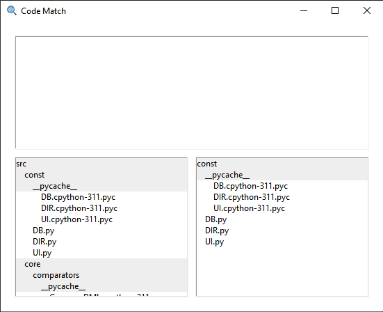

# Code Match

## Requirements

- Python 3.11
- MySQL Workbench 8.0

#

## Application Setup

Before running the application, the database needs to be set up to the system. This can be dones by running the SQL script kept in the program directory "/res/db/". This script will create a new database titled "CodeMatcher" and a user, "codematch", with all permissions.

All database handling done by the application will be executed by the Database.py folder located in the /src/core/ folder in the project directory. 

No special setup of IDE is required to run the program. After ensuring that the SQL database is setup on the system, run the App.py file. 

## Using the Application

The small header at the top of this page includes a menu to configure the options for running the comparison. 

To upload a directory from the computer, select the file icon and follow prompts to select the desired directory. The directory will be automatically be scanned into the database, but will be deleted if the database is not saved before clearing the directory or closing the program. To save a directories information to the database, click the database icon with the green arrow. 

To run a comparison, two directories need to be loaded into the code base. The same directory or subdirectory can be loaded into each directory menu without error, but this will cause the program to run slower, as theere will be a signifigantly higher amount of matched lines found. 

To select a comparator not from the default, click on the comparator and select an option from the dropdown menu. 

By default, running the comparison with no selections will compare all files uploaded in both directories. Files and folders can be selected to limit the comparison to only specific directory files. 

Running the comparison with selected files will make the program run faster, but you will be unable to view comparisons from non-selected files in the comparison window without returning to the main window and selecting the file.

When you are ready to run the code, click on the large button with two blue files in the top-right corner of the application window. 

## Comparing Directories

The initial comparison window will feature a blank display at the top, with both directories displayed side-by-side below. This comparison window is interactive, meaning any selections made to the directory windows below will display at the top of the page. 

To see the matching lines found by the comparator, select files in the right directory. If there are any matching lines, they will be listed below the file.

Files with no matched lines will simply display the filenames of the selected files from the left directory menu.

#